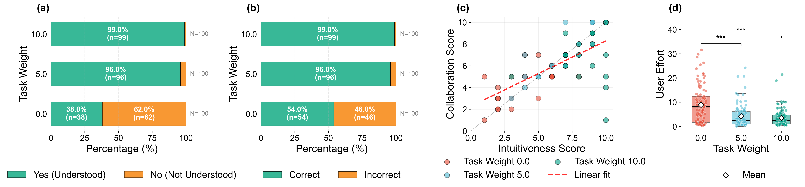

# Legible Shared Autonomy: Implicit Communication of Robot Belief through Motion

---

## Experimental Setup

<p align="center">
  
</p>

**Design:** Within-subjects study with 20 participants

**Conditions:**
- lambda=0 (Standard SA): Efficient but ambiguous motion
- lambda=5 (Medium Legibility): Balanced approach  
- lambda=10 (High Legibility): Maximum discriminative motion

**Workspace:** 2D environment (800x600 pixels) with two closely spaced goals creating directional ambiguity

---

## Trajectory Animations

<table>
  <tr>
    <td align="center"><br><sub>Participant 1</sub></td>
    <td align="center"><br><sub>Participant 2</sub></td>
    <td align="center"><br><sub>Participant 3</sub></td>
    <td align="center"><br><sub>Participant 4</sub></td>
  </tr>
  <tr>
    <td align="center"><br><sub>Participant 5</sub></td>
    <td align="center"><br><sub>Participant 6</sub></td>
    <td align="center"><br><sub>Participant 7</sub></td>
    <td align="center"><br><sub>Participant 10</sub></td>
  </tr>
  <tr>
    <td align="center"><br><sub>Participant 11</sub></td>
    <td align="center"><br><sub>Participant 12</sub></td>
    <td align="center"><br><sub>Participant 13</sub></td>
    <td align="center"><br><sub>Participant 15</sub></td>
  </tr>
  <tr>
    <td align="center"><br><sub>Participant 8</sub></td>
    <td align="center"><br><sub>Participant 9</sub></td>
    <td align="center"><br><sub>Participant 14</sub></td>
    <td align="center"><br><sub>Participant 16</sub></td>
  </tr>
  <tr>
    <td align="center"><br><sub>Participant 17</sub></td>
    <td align="center"><br><sub>Participant 18</sub></td>
    <td align="center"><br><sub>Participant 19</sub></td>
    <td align="center"><br><sub>Participant 20</sub></td>
  </tr>
</table>

---

## Main Results

<p align="center">
  
</p>

**Transparency Metrics:**
- Understanding rate: 38.0% -> 96.0% -> 99.0% (lambda=0, 5, 10)
- Friedman test: chi2(2) = 28.10, p < 0.001
- Pairwise Wilcoxon tests with Bonferroni correction: lambda=0 vs 5, p_corr < 0.001; lambda=0 vs 10, p_corr < 0.001; lambda=5 vs 10, p_corr = 0.250 (ns)
- Prediction accuracy: 54.0% -> 96.0% -> 99.0% (lambda=0, 5, 10)
- Friedman test: chi2(2) = 29.61, p < 0.001
- Pairwise Wilcoxon tests with Bonferroni correction: lambda=0 vs 5, p_corr = 0.001; lambda=0 vs 10, p_corr < 0.001; lambda=5 vs 10, p_corr = 0.307 (ns)

**Subjective Experience:**
- Intuitiveness ratings: 3.90 -> 6.70 -> 8.35 (1-10 scale)
- Collaboration ratings: 4.25 -> 7.00 -> 6.95
- Strong correlation between measures: r = 0.66, p < 0.001

**User Effort (Panel d):**
- Participant-level mean user input norm: lambda=0: 8.92 +/- 6.36 -> lambda=5: 4.25 +/- 3.36 -> lambda=10: 3.53 +/- 2.40
- Friedman test: chi2(2) = 21.70, p < 0.001
- Pairwise Wilcoxon tests with Bonferroni correction: lambda=0 vs 5, p_corr < 0.001; lambda=0 vs 10, p_corr < 0.001; lambda=5 vs 10, p_corr = 0.342 (ns)
- Both legible conditions significantly reduce user effort relative to standard shared autonomy, with no significant difference between medium and high legibility.

---

## Conclusion

Legible shared autonomy makes robot assistance more interpretable by using motion to reveal the robot's inferred user goal. In the 2D simulation study, legible motion improved transparency and reduced user effort relative to standard shared autonomy. Medium legibility already achieved most of the benefit, suggesting that legibility should be balanced with collaboration quality rather than maximized blindly.

---

## Installation

```bash
git clone https://github.com/Jinwei-Liu/legible_shared_autonomy.git
cd legible_shared_autonomy
conda create -n LSA python=3.10 -y
conda activate LSA
python -m pip install numpy pygame matplotlib pandas scipy pillow
```

## Reproduce

### Run the experiment

```bash
python experiment_collection.py
```

### Reproduce the main analysis figure

```bash
python analyze_data.py --input ./experiment_data --output ./figures
```

## Main files

- `experiment_collection.py` - interactive experiment
- `analyze_data.py` - statistical analysis and main figure
- `core/shared_autonomy.py` - shared-autonomy policy
- `core/legibility.py` - legibility objective

## Note

Pre-generated figures and trajectory animations are already included in the repository, so you can inspect the results directly without rerunning the full pipeline.
